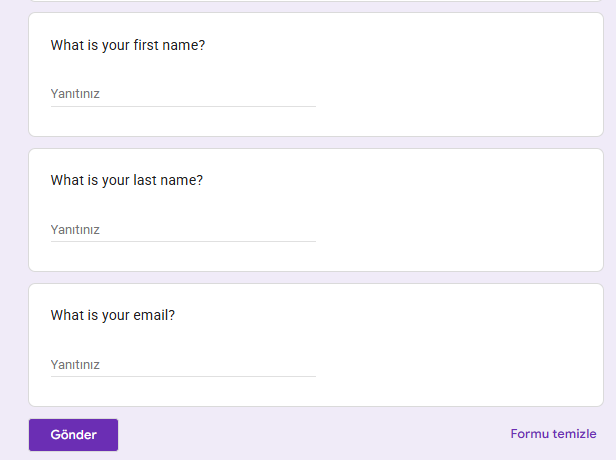
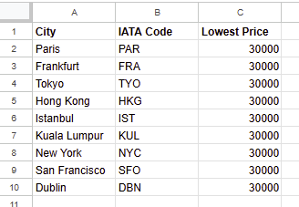
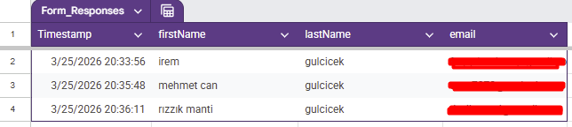
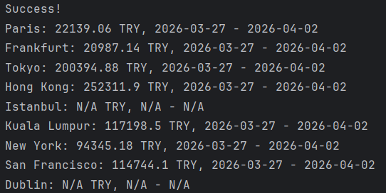
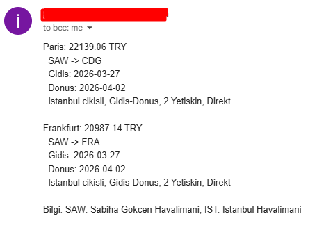

# Flight Club - Ucuz Ucus Bulucu ✈️

A Python app that finds cheap flights and emails deals to subscribers. Uses Amadeus API, Google Sheets, and Gmail SMTP.

---

## 🇹🇷 Türkçe

Kullanıcıların Google Form ile kaydolduğu, belirlenen şehirlere en ucuz uçuşları bulan ve bütçenin altında fiyat bulunduğunda tüm abonelere email ile bildirim gönderen bir Python uygulaması.

### Nasıl Çalışır?

1. Kullanıcılar Google Form üzerinden isim ve email bilgilerini girer
2. Program Google Sheets'ten hedef şehirleri, bütçeleri ve kullanıcı emaillerini çeker
3. Amadeus API ile her şehre önce direkt, bulunamazsa aktarmalı uçuş arar
4. Bulunan en ucuz fiyatı Google Sheets'teki bütçeyle karşılaştırır
5. Bütçenin altında uçuş bulunursa tüm abonelere tek bir email gönderir

### Google Form ile Kayıt

Kullanıcılar aşağıdaki form üzerinden sisteme kaydolur:



### Google Sheets

#### Prices (Şehirler ve Bütçeler)



#### Users (Kayıtlı Kullanıcılar)

Form üzerinden kaydolan kullanıcılar otomatik olarak bu sayfaya eklenir:



### Çalıştırma ve Çıktı

Program çalıştırıldığında her şehir için en ucuz uçuşu bulur:



### Email Bildirimi

Bütçenin altında uçuş bulunduğunda tüm abonelere email gönderilir:



### Proje Yapısı

| Dosya | Açıklama |
|-------|----------|
| `main.py` | Ana program — tüm sınıfları birleştirir ve akışı yönetir |
| `data_manager.py` | Google Sheets ile iletişim (Sheety API) |
| `flight_search.py` | Amadeus API ile uçuş arama ve IATA kodu bulma |
| `flight_data.py` | Uçuş verilerini işleme ve en ucuz uçuşu bulma |
| `notification_manager.py` | Email ile bildirim gönderme (Gmail SMTP) |

### Kullanılan Teknolojiler

- Python (OOP, multi-file architecture)
- Amadeus Travel API (uçuş arama, IATA kodları)
- Sheety API (Google Sheets entegrasyonu)
- Google Forms (kullanıcı kaydı)
- smtplib (email gönderimi)
- dotenv (ortam değişkenleri yönetimi)

### Özellikler

- Önce direkt uçuş arar, bulunamazsa aktarmalı uçuşları kontrol eder
- Aktarma sayısını otomatik tespit eder (direkt / 1 aktarma / 2 aktarma)
- Tüm ucuz uçuşları tek bir email'de toplar
- Google Form ile yeni kullanıcı kaydı

---

## 🇬🇧 English

A Python application where users register via Google Form, the program finds the cheapest flights to listed destinations, and sends email notifications to all subscribers when prices drop below budget.

### How It Works

1. Users register with their name and email through a Google Form
2. The program fetches destination cities, budgets, and user emails from Google Sheets
3. Searches for direct flights first via Amadeus API; if none found, searches for flights with stopovers
4. Compares the cheapest price found with the budget in Google Sheets
5. Sends a single email to all subscribers with all deals found below budget

### Project Structure

| File | Description |
|------|-------------|
| `main.py` | Main program — orchestrates all classes and manages the flow |
| `data_manager.py` | Google Sheets communication (Sheety API) |
| `flight_search.py` | Flight search and IATA code lookup (Amadeus API) |
| `flight_data.py` | Flight data processing and cheapest flight finder |
| `notification_manager.py` | Email notifications (Gmail SMTP) |

### Features

- Searches direct flights first, falls back to flights with stopovers
- Automatically detects number of stops (direct / 1 stop / 2 stops)
- Collects all cheap flights into a single email
- New user registration via Google Form

### Technologies Used

- Python (OOP, multi-file architecture)
- Amadeus Travel API (flight search, IATA codes)
- Sheety API (Google Sheets integration)
- Google Forms (user registration)
- smtplib (email sending)
- dotenv (environment variable management)

---

### Kurulum / Setup

1. Repoyu klonlayın / Clone the repository
2. Aşağıdaki değişkenlerle bir `.env` dosyası oluşturun / Create a `.env` file with the following variables:
```
SHEETY_ENDPOINT=your_sheety_prices_endpoint
SHEETY_USERS_ENDPOINT=your_sheety_users_endpoint
SHEETY_TOKEN=your_sheety_token
AMADEUS_API_KEY=your_amadeus_key
AMADEUS_API_SECRET=your_amadeus_secret
AMADEUS_ENDPOINT=https://test.api.amadeus.com/v1/security/oauth2/token
MY_EMAIL=your_email@gmail.com
MY_EMAIL_PASSWORD=your_app_password
```
3. Bağımlılıkları yükleyin / Install dependencies: `pip install requests python-dotenv`
4. Çalıştırın / Run: `python main.py`
